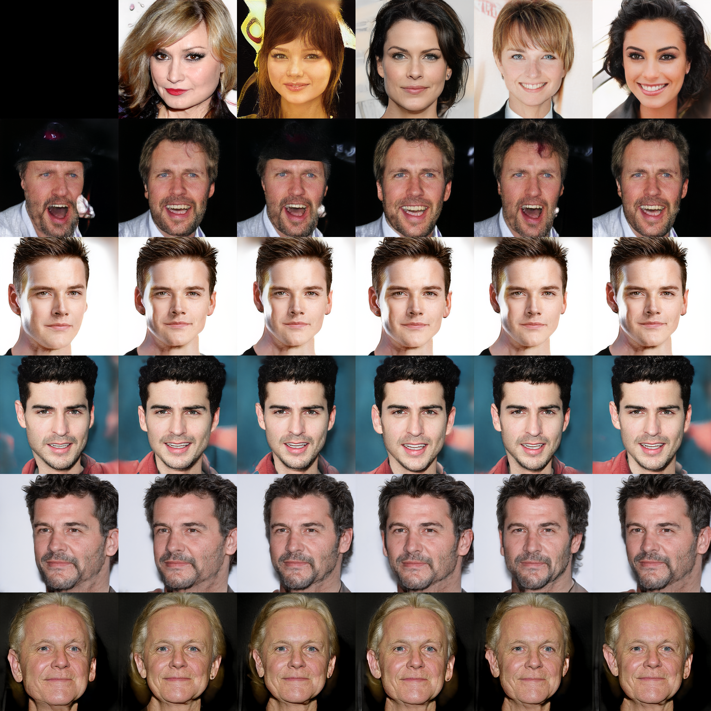
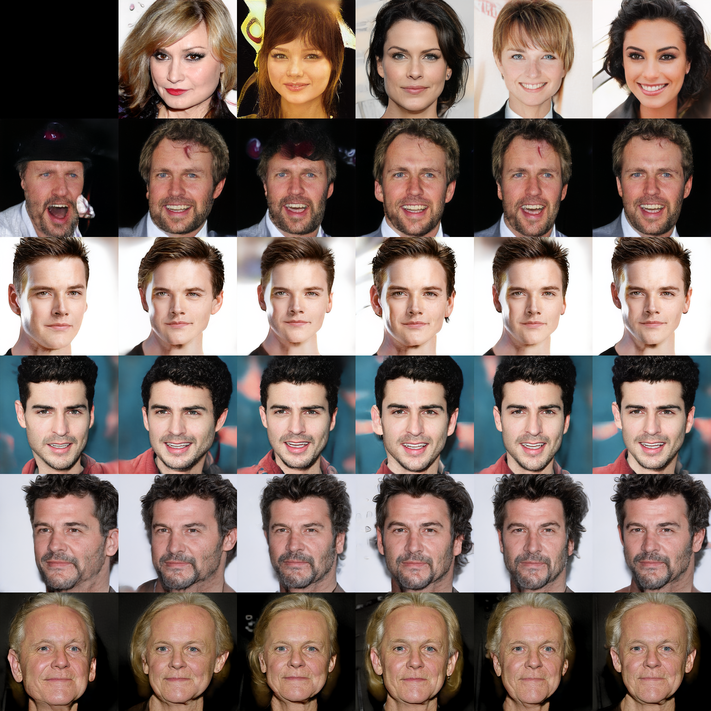
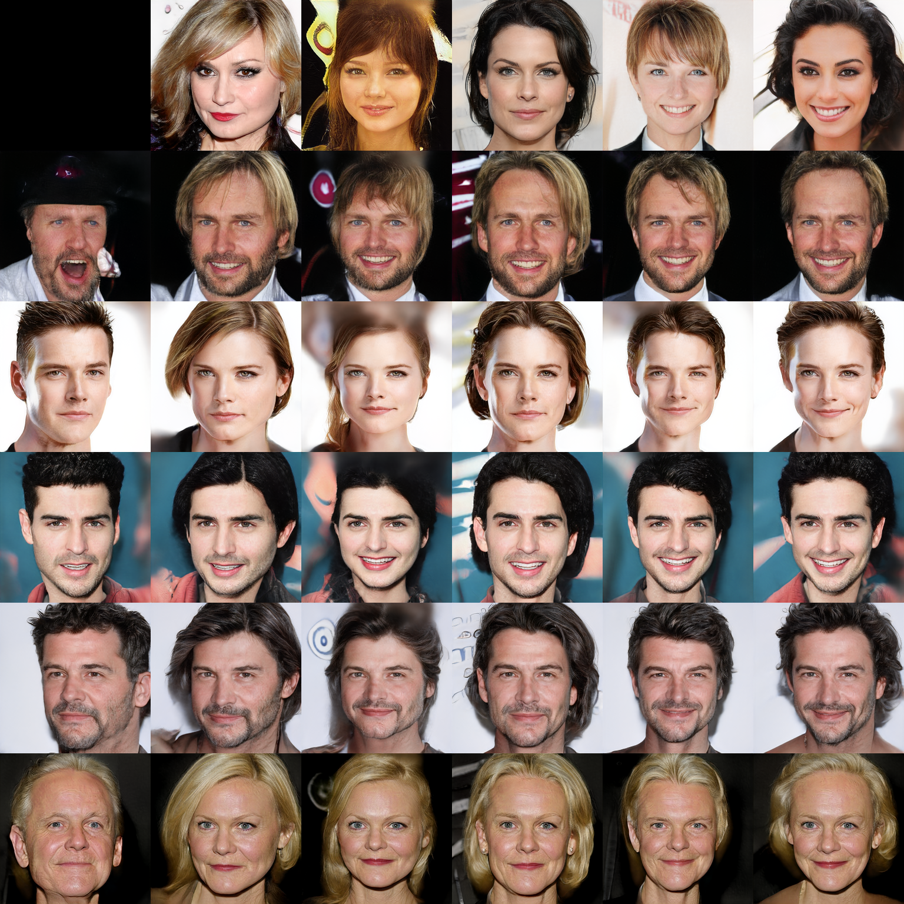
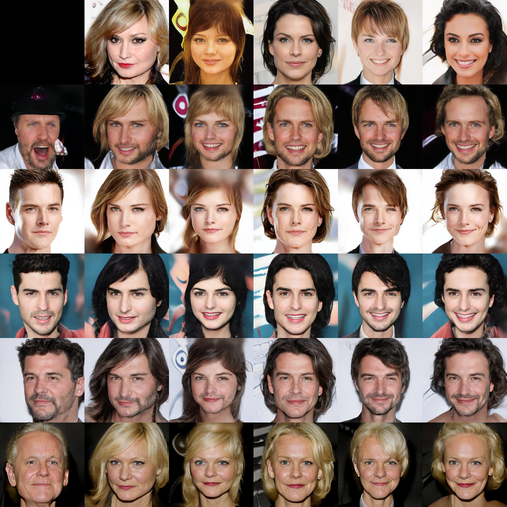
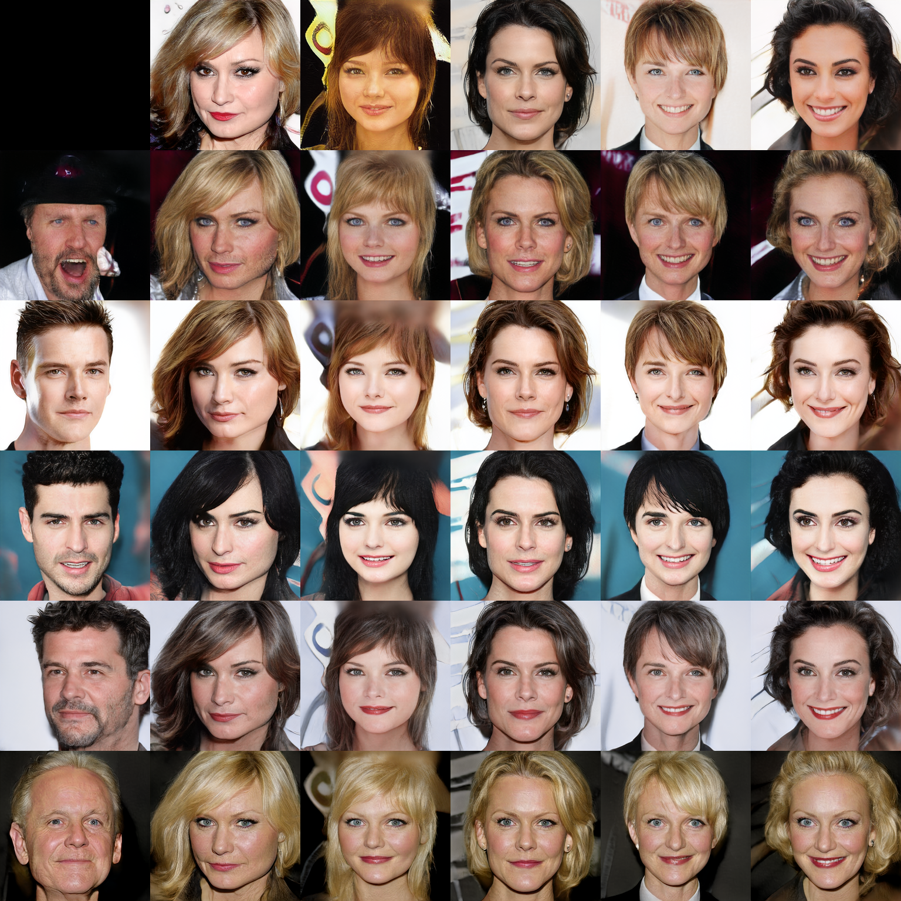
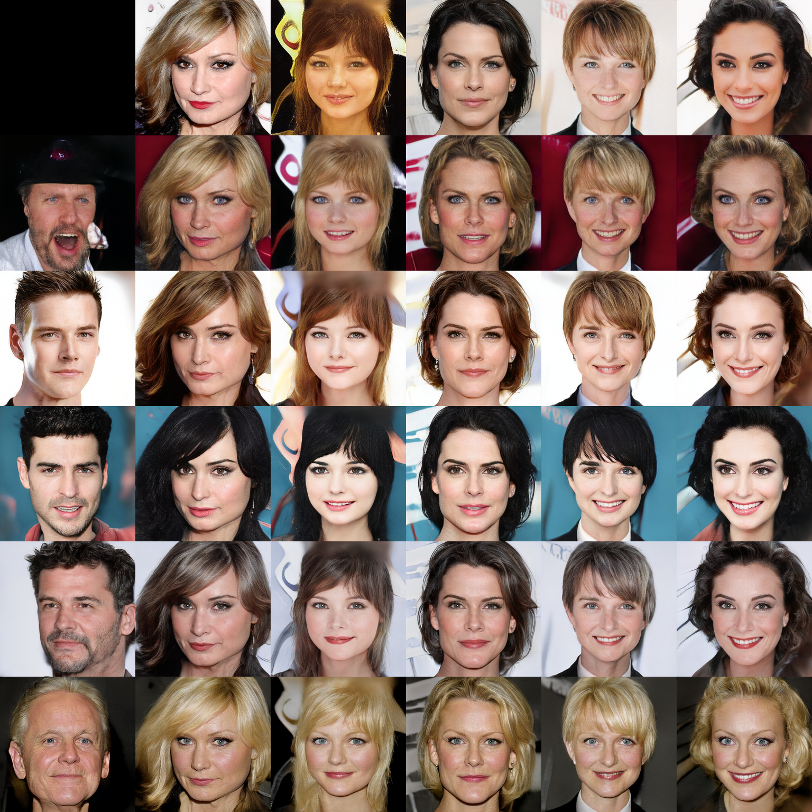
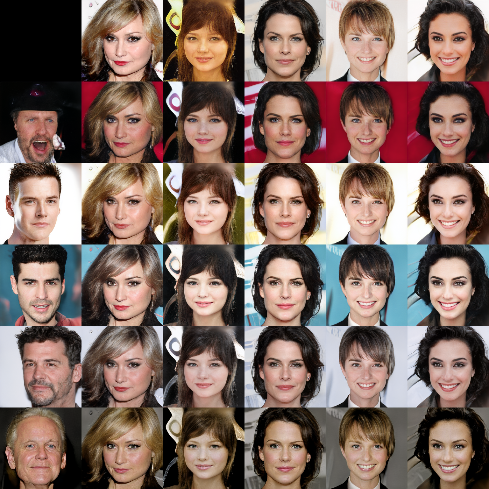

# StyleGAN2-ADA-colab

This repository provides the method how to run the NVIDIA StyleGAN2-ADA with colab.

In this case, I utilize the CelebA-HQ Dataset and do transfer learning with FFHQ 256.pkl file.

## Results

|256x256 Source Image / Reference Image|
|Style 0|
||
|:---:|
|Style 0-1|
||
|:---:|
|Style 0-2|
||
|:---:|
|Style 0-3|
||
|:---:|
|Style 0-4|
||
|:---:|
|Style 0-5|
||
|:---:|
|Style 0-6|
||
